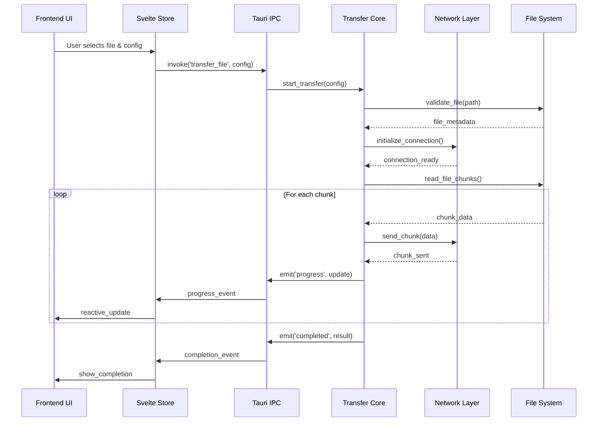
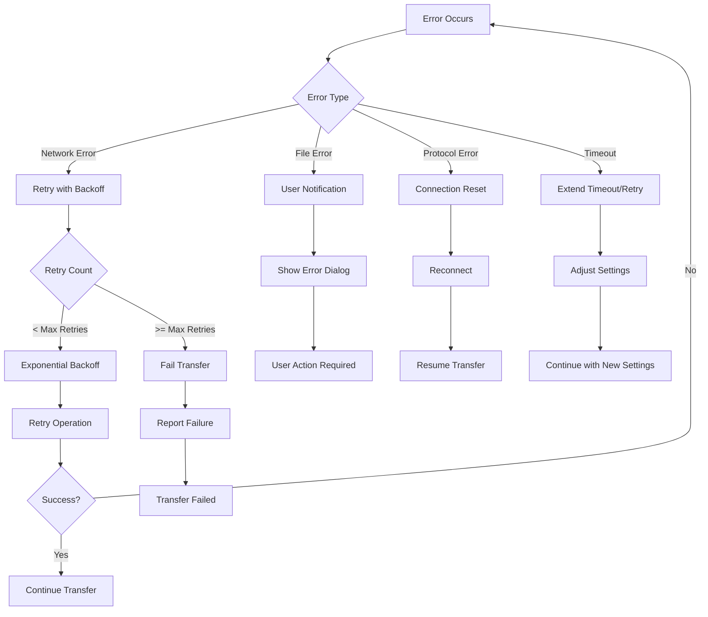

# Architecture Overview

Comprehensive technical documentation of the File Transfer Application architecture, design patterns, and implementation details.

## 📋 Table of Contents

- [System Architecture](#system-architecture)
- [Component Design](#component-design)
- [Protocol Implementation](#protocol-implementation)
- [Data Flow](#data-flow)
- [Security Architecture](#security-architecture)
- [Performance Considerations](#performance-considerations)

## 🏗️ System Architecture

### High-Level Architecture

```
┌─────────────────────────────────────────────────────────────────┐
│                    File Transfer Application                     │
├─────────────────────────────────────────────────────────────────┤
│  Frontend Layer (Svelte + Tauri)                              │
│  ┌─────────────────┐  ┌─────────────────┐  ┌─────────────────┐ │
│  │   UI Components │  │  State Stores   │  │  Event Handlers │ │
│  │                 │  │                 │  │                 │ │
│  │ • ModeSelector  │  │ • transferStore │  │ • Progress      │ │
│  │ • FileDropZone  │  │ • configStore   │  │ • Error         │ │
│  │ • Progress      │  │ • historyStore  │  │ • Completion    │ │
│  └─────────────────┘  └─────────────────┘  └─────────────────┘ │
├─────────────────────────────────────────────────────────────────┤
│  IPC Layer (Tauri Commands & Events)                          │
│  ┌─────────────────┐  ┌─────────────────┐  ┌─────────────────┐ │
│  │    Commands     │  │     Events      │  │   Serialization │ │
│  │                 │  │                 │  │                 │ │
│  │ • transfer_file │  │ • progress      │  │ • JSON/Serde    │ │
│  │ • receive_file  │  │ • error         │  │ • Type Safety   │ │
│  │ • cancel        │  │ • completion    │  │ • Validation    │ │
│  └─────────────────┘  └─────────────────┘  └─────────────────┘ │
├─────────────────────────────────────────────────────────────────┤
│  Backend Layer (Rust Library + CLI)                           │
│  ┌─────────────────┐  ┌─────────────────┐  ┌─────────────────┐ │
│  │  Core Transfer  │  │  Network Layer  │  │  File System    │ │
│  │                 │  │                 │  │                 │ │
│  │ • Orchestrator  │  │ • TCP Sockets   │  │ • File I/O      │ │
│  │ • Progress      │  │ • UDP Sockets   │  │ • Checksums     │ │
│  │ • Session Mgmt  │  │ • Protocol Impl │  │ • Validation    │ │
│  └─────────────────┘  └─────────────────┘  └─────────────────┘ │
├─────────────────────────────────────────────────────────────────┤
│  Infrastructure Layer                                          │
│  ┌─────────────────┐  ┌─────────────────┐  ┌─────────────────┐ │
│  │     Logging     │  │  Error Handling │  │  Configuration  │ │
│  │                 │  │                 │  │                 │ │
│  │ • Structured    │  │ • Recovery      │  │ • Persistence   │ │
│  │ • Levels        │  │ • Retry Logic   │  │ • Validation    │ │
│  │ • Filtering     │  │ • User Friendly │  │ • Defaults      │ │
│  └─────────────────┘  └─────────────────┘  └─────────────────┘ │
└─────────────────────────────────────────────────────────────────┘
```

### Deployment Architecture

```
┌─────────────────────────────────────────────────────────────────┐
│                      Deployment Options                         │
├─────────────────────────────────────────────────────────────────┤
│  Desktop Application                                            │
│  ┌─────────────────────────────────────────────────────────────┐ │
│  │  Tauri Bundle (Windows .msi, macOS .dmg, Linux .deb/.rpm)  │ │
│  │  ┌─────────────────┐  ┌─────────────────┐                  │ │
│  │  │  Svelte Frontend│  │   Rust Backend  │                  │ │
│  │  │  (Web Assets)   │  │   (Native Lib)  │                  │ │
│  │  └─────────────────┘  └─────────────────┘                  │ │
│  └─────────────────────────────────────────────────────────────┘ │
├─────────────────────────────────────────────────────────────────┤
│  Command Line Interface                                         │
│  ┌─────────────────────────────────────────────────────────────┐ │
│  │  Native Binary (file-transfer-cli)                         │ │
│  │  ┌─────────────────┐  ┌─────────────────┐                  │ │
│  │  │   CLI Parser    │  │  Transfer Core  │                  │ │
│  │  │   (clap)        │  │  (Shared Lib)   │                  │ │
│  │  └─────────────────┘  └─────────────────┘                  │ │
│  └─────────────────────────────────────────────────────────────┘ │
├─────────────────────────────────────────────────────────────────┤
│  Docker Containers                                              │
│  ┌─────────────────────────────────────────────────────────────┐ │
│  │  Multi-Container Setup                                      │ │
│  │  ┌─────────────────┐  ┌─────────────────┐                  │ │
│  │  │   Sender        │  │   Receiver      │                  │ │
│  │  │   Container     │  │   Container     │                  │ │
│  │  └─────────────────┘  └─────────────────┘                  │ │
│  │  ┌─────────────────────────────────────────┐                │ │
│  │  │         Network Router                  │                │ │
│  │  │      (Multi-Network Setup)             │                │ │
│  │  └─────────────────────────────────────────┘                │ │
│  └─────────────────────────────────────────────────────────────┘ │
└─────────────────────────────────────────────────────────────────┘
```

## 🧩 Component Design

### Backend Components

#### Core Transfer Module
```rust
// src/core/transfer/
pub struct TransferOrchestrator {
    session_manager: SessionManager,
    progress_tracker: ProgressTracker,
    communication_manager: CommunicationManager,
    event_emitter: Box<dyn EventEmitter>,
}

impl TransferOrchestrator {
    pub async fn start_transfer(&mut self, config: TransferConfig) -> Result<TransferResult>;
    pub async fn cancel_transfer(&mut self, transfer_id: &str) -> Result<()>;
    pub fn get_progress(&self, transfer_id: &str) -> Option<TransferProgress>;
}
```

**Responsibilities**:
- Coordinate all transfer operations
- Manage transfer lifecycle
- Emit progress events
- Handle cancellation requests

#### Network Layer
```rust
// src/network/
pub trait NetworkTransfer {
    async fn send_file(&mut self, file_path: PathBuf, target: SocketAddr) -> Result<TransferResult>;
    async fn receive_file(&mut self, output_path: PathBuf) -> Result<TransferResult>;
}

pub struct TcpTransfer {
    socket: Option<TcpStream>,
    config: TransferConfig,
}

pub struct UdpTransfer {
    socket: Option<UdpSocket>,
    config: TransferConfig,
}
```

**Design Patterns**:
- **Strategy Pattern**: Different protocols implement same interface
- **Factory Pattern**: Protocol selection creates appropriate implementation
- **Observer Pattern**: Progress updates via event emission

#### File System Layer
```rust
// src/core/files/
pub struct FileChunker {
    chunk_size: usize,
    total_chunks: usize,
    current_chunk: usize,
}

pub struct ChecksumCalculator;

impl ChecksumCalculator {
    pub fn calculate_sha256(path: &Path) -> Result<String>;
    pub fn verify_integrity(expected: &str, actual: &str) -> bool;
}
```

**Features**:
- Streaming file processing
- Memory-efficient chunking
- Integrity verification
- Progress tracking

### Frontend Components

#### Component Architecture
```typescript
// Component Hierarchy
App
├── ModeSelector
├── ConnectionConfig
├── FileSelection
│   ├── FileDropZone
│   └── FilePreview
├── TransferProgress
├── TransferHistory
│   ├── HistoryList
│   └── HistoryDetails
└── Settings
    ├── NotificationSettings
    └── TimeoutSettings
```

#### State Management
```typescript
// stores/transfer.ts
interface TransferState {
  currentTransfer: TransferProgress | null;
  history: TransferRecord[];
  config: TransferConfig;
  errors: TransferError[];
}

// Reactive state updates
export const transferStore = writable<TransferState>(initialState);
export const transferActions = {
  startTransfer,
  cancelTransfer,
  updateProgress,
  addToHistory
};
```

**Patterns**:
- **Reactive Programming**: Svelte stores for state management
- **Component Composition**: Reusable UI components
- **Event-Driven**: Tauri events for backend communication

## 🌐 Protocol Implementation

### TCP Implementation (Reliable)

#### Connection Flow
```
Client                          Server
  |                              |
  |  1. TCP SYN                 |
  |----------------------------->|
  |  2. TCP SYN-ACK             |
  |<-----------------------------|
  |  3. TCP ACK                 |
  |----------------------------->|
  |  [CONNECTION ESTABLISHED]   |
  |                              |
  |  4. FileMetadata            |
  |----------------------------->|
  |  5. MetadataAck             |
  |<-----------------------------|
  |                              |
  |  6. DataChunk(seq=1, 8KB)   |
  |----------------------------->|
  |  7. ChunkAck(seq=1)         |
  |<-----------------------------|
  |  ... (repeat for all chunks) |
  |                              |
  |  N. FinalChecksum           |
  |----------------------------->|
  |  N+1. ChecksumAck           |
  |<-----------------------------|
  |  N+2. TCP FIN               |
  |----------------------------->|
  |  N+3. TCP FIN-ACK           |
  |<-----------------------------|
```

#### Message Format
```rust
#[derive(Serialize, Deserialize)]
pub enum TcpProtocolMessage {
    FileMetadata {
        filename: String,
        size: u64,
        checksum: String,
    },
    MetadataAck {
        accepted: bool,
        reason: Option<String>,
    },
    DataChunk {
        sequence: u32,
        data: Vec<u8>,  // 8KB chunks
    },
    ChunkAck {
        sequence: u32,
        status: AckStatus,
    },
    FinalChecksum {
        checksum: String,
    },
    ChecksumAck {
        verified: bool,
    },
    Error {
        code: String,
        message: String,
    },
}
```

### UDP Implementation (Fire-and-Forget)

#### Transfer Flow
```
Sender                          Receiver
  |                              |
  |  [NO CONNECTION SETUP]      |
  |                              |
  |  1. DataChunk(1KB)          |
  |----------------------------->|
  |  2. DataChunk(1KB)          |
  |----------------------------->|
  |  3. DataChunk(1KB)          |
  |----------------------------->|
  |  ... (continuous sending)    |
  |                              |
  |  N. DataChunk(1KB, last)    |
  |----------------------------->|
  |  N+1. FinMarker             |
  |----------------------------->|
  |  N+2. FinMarker             |
  |----------------------------->|
  |  N+3. FinMarker             |
  |----------------------------->|
  |  [SENDER COMPLETES]         |
  |                              |
  |                         [RECEIVER]
  |                     [30s TIMEOUT]
  |                     [ASSUMES END]
```

#### Message Format
```rust
#[derive(Serialize, Deserialize)]
pub enum UdpProtocolMessage {
    DataChunk {
        data: Vec<u8>,  // 1KB chunks
    },
    FinMarker,  // Empty marker to signal end
}
```

### Protocol Comparison

| Feature | TCP | UDP |
|---------|-----|-----|
| **Connection** | Required (3-way handshake) | None |
| **Reliability** | Guaranteed delivery | Best effort |
| **Ordering** | Guaranteed order | No guarantees |
| **Error Detection** | Built-in + Application level | None |
| **Flow Control** | TCP + Application ACKs | None |
| **Chunk Size** | 8KB (configurable) | 1KB (fixed) |
| **Metadata Exchange** | Yes (filename, size, checksum) | No |
| **Completion Detection** | Checksum verification | Timeout-based |
| **Use Case** | Critical files | Fast transfers |

## 🔄 Data Flow

### Transfer Initiation Flow



### Error Handling Flow



## 🔒 Security Architecture

### Security Principles

#### Data Integrity
- **SHA-256 Checksums**: File integrity verification (TCP only)
- **Chunk Validation**: Individual chunk integrity checking
- **End-to-End Verification**: Source to destination validation

#### Input Validation
```rust
pub fn validate_transfer_config(config: &TransferConfig) -> Result<(), ValidationError> {
    // IP address validation
    if let Some(ip) = &config.target_ip {
        ip.parse::<IpAddr>()
            .map_err(|_| ValidationError::InvalidIpAddress)?;
    }
    
    // Port range validation
    if config.port < 1024 || config.port > 65535 {
        return Err(ValidationError::InvalidPort);
    }
    
    // File path validation
    if let Some(path) = &config.file_path {
        if path.contains("..") {
            return Err(ValidationError::PathTraversal);
        }
    }
    
    Ok(())
}
```

#### Memory Safety
- **Rust Language**: Memory safety guarantees
- **Buffer Management**: Controlled buffer sizes
- **Resource Cleanup**: Automatic resource management

#### Network Security
- **No Authentication**: Currently no built-in authentication
- **Local Network Focus**: Designed for trusted networks
- **Firewall Friendly**: Standard port usage

### Security Limitations

#### Current Limitations
- **No Encryption**: Data transmitted in plaintext
- **No Authentication**: No user verification
- **No Authorization**: No access control
- **Network Exposure**: Vulnerable to network sniffing

#### Recommended Mitigations
- **VPN Usage**: Use VPN for remote transfers
- **Trusted Networks**: Only use on trusted networks
- **Firewall Rules**: Restrict port access
- **File Permissions**: Proper file system permissions

## ⚡ Performance Considerations

### Memory Management

#### Streaming Architecture
```rust
// Memory-efficient file processing
pub struct StreamingFileReader {
    file: File,
    buffer: Vec<u8>,
    chunk_size: usize,
}

impl StreamingFileReader {
    pub fn read_chunk(&mut self) -> Result<Option<Vec<u8>>> {
        self.buffer.clear();
        self.buffer.resize(self.chunk_size, 0);
        
        match self.file.read(&mut self.buffer)? {
            0 => Ok(None),  // EOF
            n => {
                self.buffer.truncate(n);
                Ok(Some(self.buffer.clone()))
            }
        }
    }
}
```

#### Memory Usage Patterns
- **Constant Memory**: O(1) memory usage regardless of file size
- **Buffer Reuse**: Reuse buffers to minimize allocations
- **Streaming Processing**: Process files without loading entirely

### Network Optimization

#### TCP Optimizations
- **Nagle's Algorithm**: Disabled for low latency
- **TCP Window Scaling**: Automatic window size adjustment
- **Keep-Alive**: Connection health monitoring

#### UDP Optimizations
- **Batch Sending**: Multiple packets per system call
- **Buffer Sizing**: Optimal buffer sizes for throughput
- **Minimal Overhead**: Reduced protocol overhead

### Concurrency Model

#### Async/Await Architecture
```rust
// Non-blocking I/O operations
pub async fn transfer_file_async(config: TransferConfig) -> Result<TransferResult> {
    let mut connection = establish_connection(&config).await?;
    let mut file_reader = StreamingFileReader::new(&config.file_path)?;
    
    while let Some(chunk) = file_reader.read_chunk()? {
        connection.send_chunk(chunk).await?;
        
        // Yield control to allow other operations
        tokio::task::yield_now().await;
    }
    
    Ok(TransferResult::success())
}
```

#### Performance Characteristics
- **Single-threaded**: One transfer per instance
- **Non-blocking I/O**: Efficient resource utilization
- **Event-driven**: Reactive to network events

### Scalability Considerations

#### Current Limitations
- **Single Transfer**: One active transfer at a time
- **Memory Bound**: Limited by available RAM
- **Network Bound**: Limited by network bandwidth

#### Scaling Strategies
- **Multiple Instances**: Run multiple CLI instances
- **Batch Processing**: Queue multiple transfers
- **Resource Monitoring**: Monitor system resources

## 🔧 Configuration Architecture

### Configuration Hierarchy

```
Configuration Sources (Priority Order):
1. Command Line Arguments (Highest)
2. Environment Variables
3. Configuration Files
4. Application Defaults (Lowest)
```

#### Configuration Structure
```rust
#[derive(Debug, Clone, Serialize, Deserialize)]
pub struct TransferConfig {
    // Network settings
    pub mode: TransferMode,
    pub protocol: Protocol,
    pub target_ip: Option<String>,
    pub port: u16,
    
    // Transfer settings
    pub chunk_size: usize,
    pub timeout: Duration,
    pub max_retries: u32,
    
    // File settings
    pub file_path: Option<PathBuf>,
    pub output_directory: Option<PathBuf>,
    
    // Advanced settings
    pub buffer_size: usize,
    pub compression: bool,
    pub verify_checksums: bool,
}
```

### Default Values

| Setting | TCP Default | UDP Default | Range |
|---------|-------------|-------------|-------|
| **Chunk Size** | 8192 bytes | 1024 bytes | 512-65536 |
| **Timeout** | 30 seconds | 30 seconds | 5-300 |
| **Max Retries** | 3 | 0 | 0-10 |
| **Buffer Size** | 64KB | 8KB | 4KB-1MB |
| **Port** | 8080 | 8080 | 1024-65535 |

## 📊 Monitoring and Observability

### Logging Architecture

#### Log Levels
```rust
// Structured logging with multiple levels
use tracing::{error, warn, info, debug, trace};

// Error: Critical failures
error!("Transfer failed: {}", error);

// Warn: Recoverable issues
warn!("Retry attempt {} of {}", attempt, max_retries);

// Info: Important events
info!("Transfer started: {} -> {}", source, target);

// Debug: Detailed operation info
debug!("Chunk {} sent successfully", sequence);

// Trace: Very detailed debugging
trace!("Buffer state: {} bytes available", buffer.len());
```

#### Log Output Formats
- **Console**: Human-readable format for development
- **JSON**: Structured format for log aggregation
- **File**: Persistent logging to files

### Metrics Collection

#### Transfer Metrics
```rust
pub struct TransferMetrics {
    pub bytes_transferred: u64,
    pub transfer_speed: f64,      // bytes/second
    pub duration: Duration,
    pub chunk_count: u32,
    pub retry_count: u32,
    pub error_count: u32,
}
```

#### Performance Metrics
- **Throughput**: Bytes per second
- **Latency**: Round-trip time for acknowledgments
- **Error Rate**: Failed operations percentage
- **Resource Usage**: CPU and memory consumption

### Health Monitoring

#### System Health Checks
```rust
pub struct HealthCheck {
    pub network_connectivity: bool,
    pub file_system_access: bool,
    pub memory_usage: f64,
    pub cpu_usage: f64,
}

impl HealthCheck {
    pub async fn perform_check() -> Self {
        // Implementation details...
    }
}
```

## 🔄 Future Architecture Considerations

### Planned Enhancements

#### Security Improvements
- **TLS Encryption**: End-to-end encryption
- **Authentication**: User verification system
- **Certificate Management**: PKI infrastructure

#### Performance Enhancements
- **Parallel Transfers**: Multiple concurrent transfers
- **Compression**: On-the-fly data compression
- **Delta Sync**: Incremental file updates

#### Feature Additions
- **Resume Capability**: Resume interrupted transfers
- **Bandwidth Limiting**: QoS controls
- **Directory Sync**: Folder synchronization

### Architectural Evolution

#### Microservices Transition
```
Current Monolithic Architecture
         ↓
Service-Oriented Architecture
         ↓
Microservices Architecture
```

#### Cloud Integration
- **Cloud Storage**: Integration with cloud providers
- **Serverless**: Function-based processing
- **Container Orchestration**: Kubernetes deployment

---

*This architecture documentation reflects version 1.0.0 of the File Transfer Application. For implementation details, see the [API Reference](api-reference.md).*